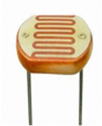

# Light Dependent Resistor

A Light Dependent Resistor (LDR) is a semiconductor that changes its electrical resistance when exposed to light. It is also called as a photoresistor and photocell. Figure 1 shows a photoresistor as one leg of a voltage divider circuit.

Its applications include smoke detection, automatic lighting control, batch counting and burglar alarm systems.  
jkjk

